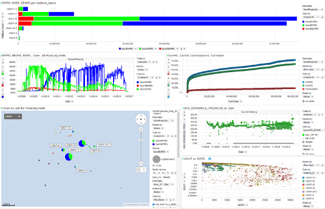
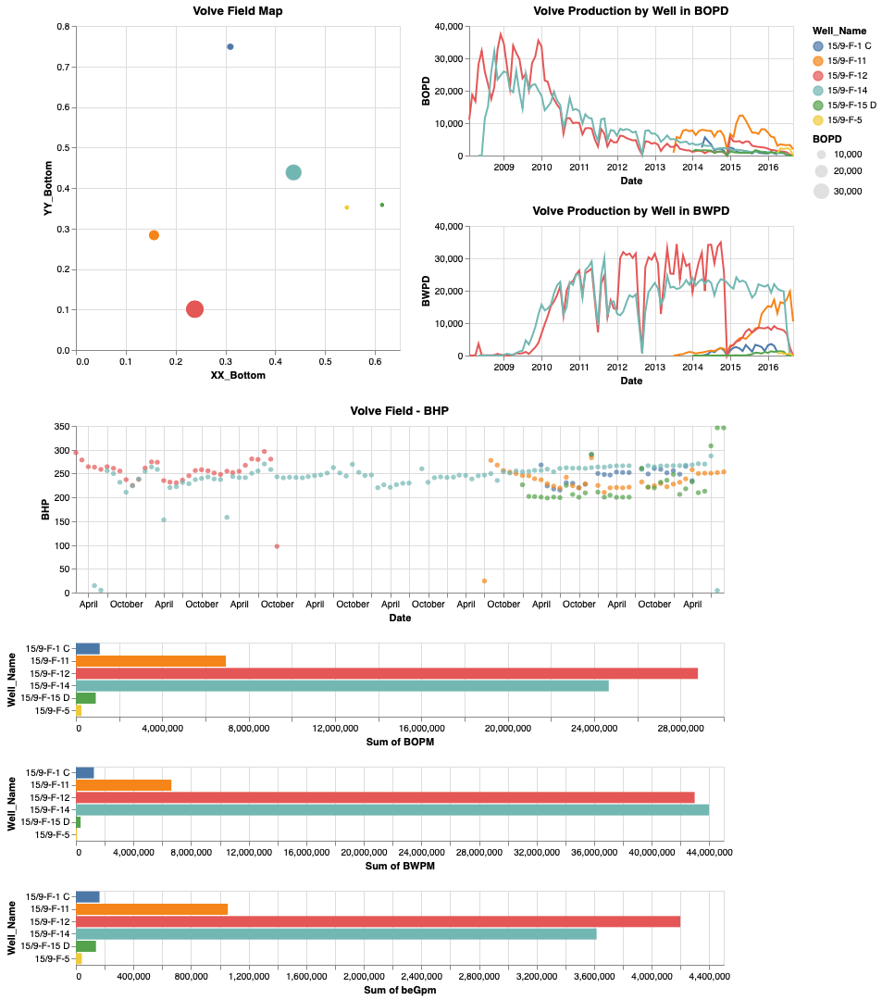

# Visualize well-by-well Production Data using Python's Interactive Altair
The objective of this project is to interactively interrogate oil field production data using Altair. 

This is our first attempt to use Altair to interactively interrogate and visualize the well-by-well production data from Equinor's Volve Field using python Altair. Altair has great potential allowing us to dynamically link our data. As we learn how to use all of capabilities of Altair, we will be updating this reqospitory as we learn. In this example we start with a field map of Volve Field. We start the process by selecting a well or group of wells and the plots below will show the corresponding data for that well or wells. this is just the tip of the iceberg. 

We normally do this type of work in Spotfire where we always prefer to tie our petrophysical results into the actual production and pressures from a field-wide perspective. 

However, we would like to exploit the capabilities of Altair to see if we can achieve similar interactivity as what we have in Spotfire. 

We are using Conda on a mac and Altair works fairly well in a jupyter notebook. To run as pure python program altair_viewer must also be used to render the images to a html web page. We are low on the learning curve with Altair finding new capabilities each day. Consider this repository an example of where we are today. 

We have also included a basic Altair_Volve_Production.py python script as an example too.

We will also be pursuing additional petrophysical applications for Altair in the near future. 
